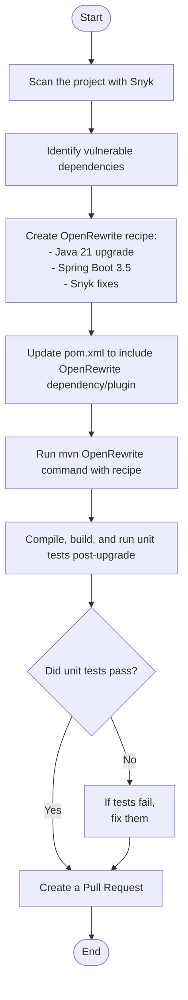

```mermaid
flowchart TD
    A([Start])
    B[Scan the project with Snyk]
    C[Identify vulnerable dependencies]
    D[Create OpenRewrite recipe:<br/>- Java 21 upgrade<br/>- Spring Boot 3.5<br/>- Snyk fixes]
    E[Update pom.xml to include OpenRewrite dependency/plugin]
    F[Run mvn OpenRewrite command with recipe]
    G[Compile, build, and run unit tests post-upgrade]
    H{Did unit tests pass?}
    I[If tests fail,<br/>fix them]
    J[Create a Pull Request]
    K([End])

    A --> B --> C --> D --> E --> F --> G --> H
    H -- Yes --> J --> K
    H -- No --> I --> J
```
